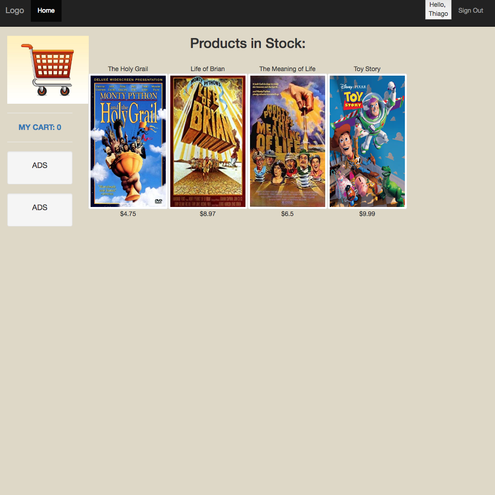
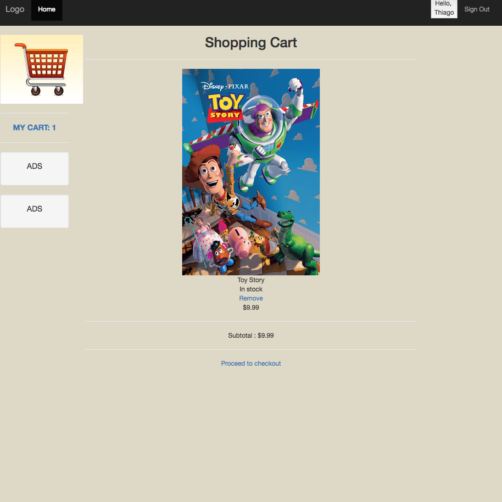

  

  This project was part of an optional challenge posed by my Python professor, in which we were asked to produce a web app for a client that needed an e-commerce solution to list his products with the ability for easy expansion as needed. The web app was designed with the requirements of an e-commerce system in mind. As the sole programmer responsible for the system's design, I decided to modularize the program conservatively in order to have the ability to easily expand the project as new client requests came in. 

  This project was developed mainly in Python using Flask as the framework and SQLITE for its database. Additionally, the basic UI featured is wrapped with bootstrap using HTML and CSS. The app features user registration and login forms, shopping cart implementation and a checkout system ready to be linked to a web service.

You can learn more at the [Youtube Presentation](https://www.youtube.com/watch?v=IiX1-jgtu4s&t=162s).

The source code is available at [Github](https://github.com/ThiagoM728/e-commerceWebApp).

  
  
  

