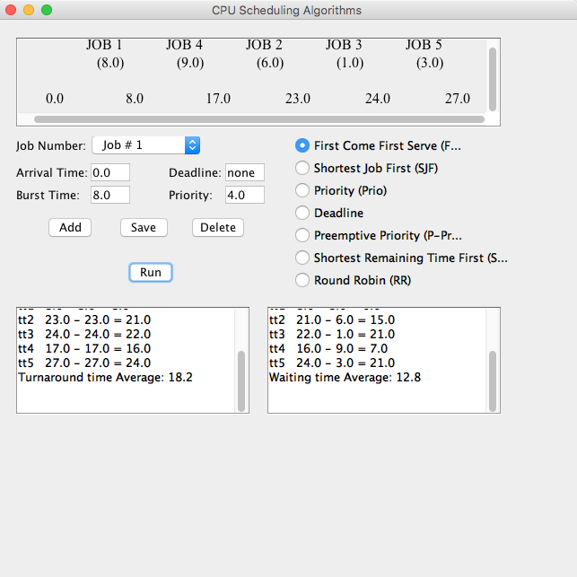

Operating Systems is a very integral topic in computer science and as such several of my classes during my studies at FAU covered this topic at length. One thing about CPU scheduling is that the calculations of processes specifically when demonstrated in a Gantt Chart could be a very tedious task that requires a very methodical and careful data control and record keeping in order to return the proper results. With that in mind, my intent was to develop a solution to an issue my classmates and I encountered frequently which is ending with a incorrect result in our Gantt Charts and thus needing to spend more time debugging our calculations or restarting the entire process. 

The application was initially designed to hold two algorithms, namely FCFS (first come first serve) and SJF (shortest job first) and as the semester continued I adjusted the program to hold additional algorithms. Since it is written in Java, the source code can run on any Java compatible IDE. In addition I exported the .jar file and converted it into a MacOS compatible application for some of my classmates who needed help running the program.

